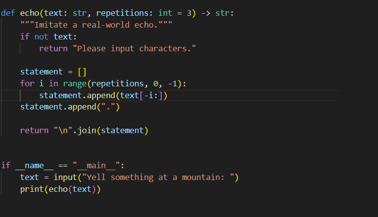
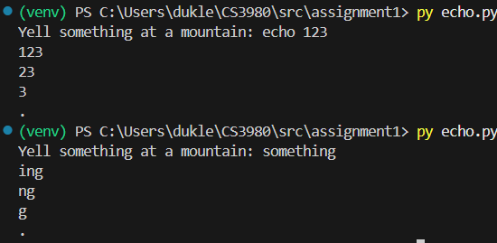
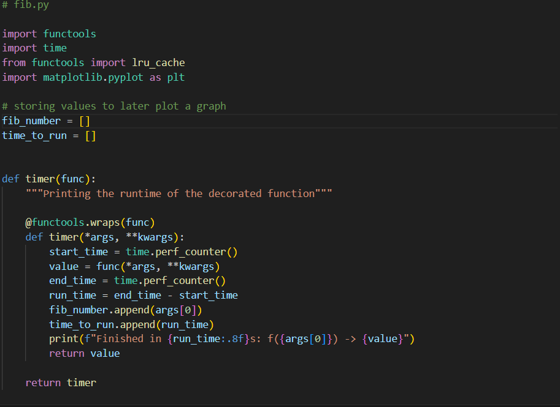
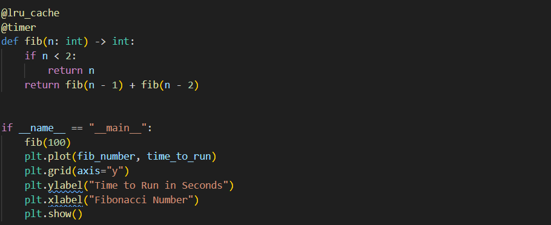
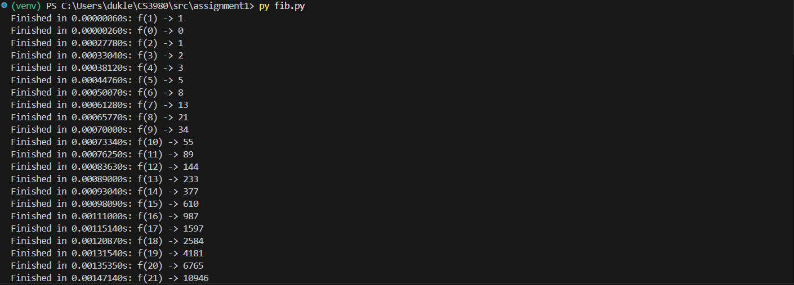
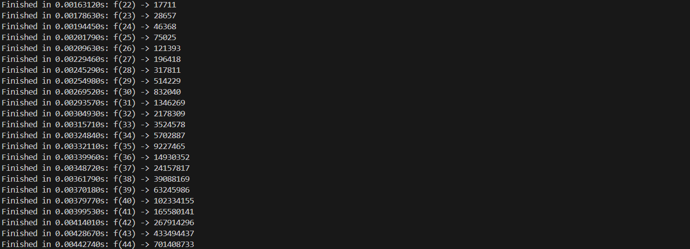
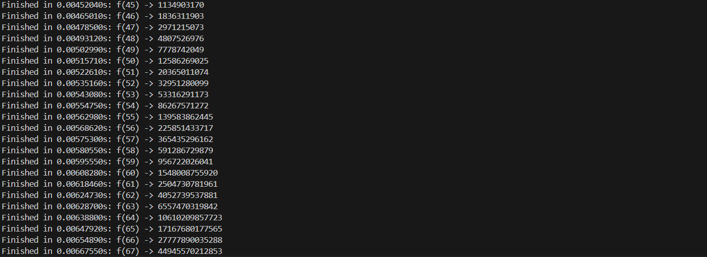
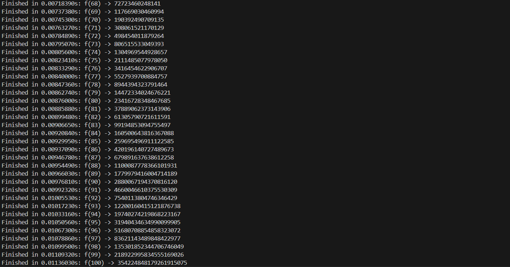
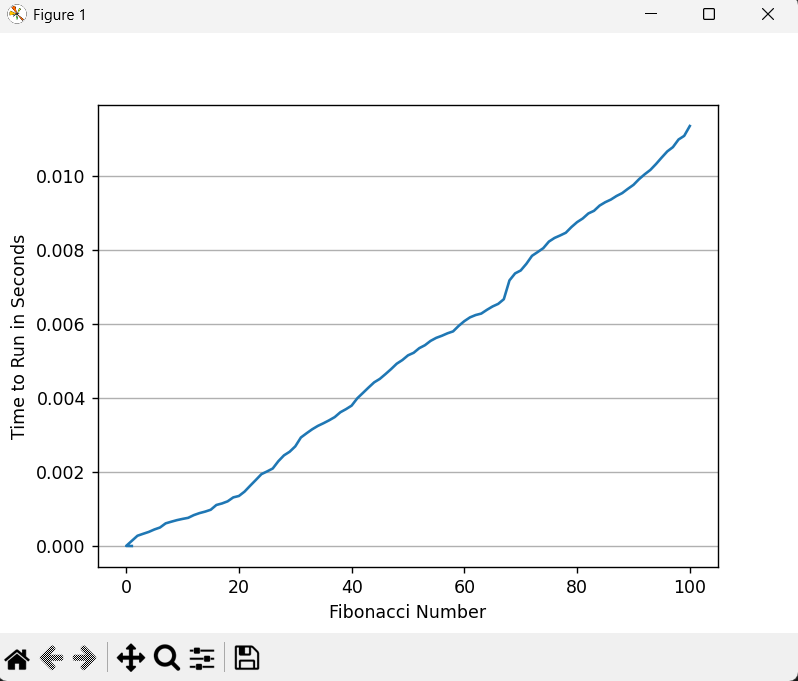

# Assignment 1: Python Refresher for CS3980
This assignment was done to refresh my knowledge on Python and specifically learn how to use decorators. 

## Part 1: Python Programming Basics
This part produced output that mimicked an echo in real-life. I followed the code snippet provided and used a for loop to iteratively go through the provided text, outputting the last three characters, then the last two, then the last one, followed by a period. I added each segment to a list and then printed the joined values in the list.

#### Code snippet:

#### Code output:

## Part 2: Python Decorator Implementation
This part used a lru_cache decorator from a Python package called functools, as well as a timer decorator. The timer decorator calculated the runtime and saved that value, as well as the Fibonacci number, to separate lists, which were later referenced to plot a graph. I also created a virtual environment for this assignment to practice installing packages in a specific environment, rather than globally. 

#### Code snippet:

#### Code output:

#### Graph output:

This graph displays the Fibonacci number for calculation on the x axis and the time it took in seconds to compute the calculation (measured by the timer decorator) on the y-axis. Without using the lru_cache decorator, we would expect the time it takes to calculate these Fibonacci calculations to grow exponentially since each value gets computed individually multiple times. As a result, the graph would yield an exponential line. However, with caching, the result gets stored in memory and thus can return future calls faster than without caching the data. Since each value is only calculated once, the time grows more linearly, as opposed to exponential. We still see an increase, however, as the arithmetic operations are occurring on larger integers. Overall, this example shows the importance and necessity of using caching to best optimize calculations and, on a broader scale, larger projects. 
